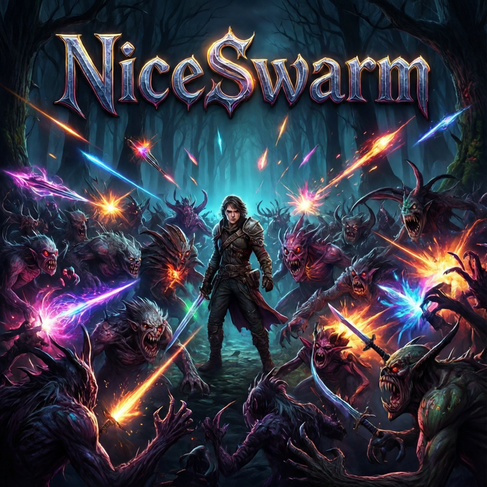

# NiceSwarm



A top-down **arena-survival roguelite** (Vampire-Survivors-like) with **online co-op**,
built entirely in **Godot 4 / GDScript** — no art assets, every entity drawn in code.
You move; your weapons fire themselves. Collect XP, level up, pick upgrades, **fuse**
weapons, and survive **10 minutes** against an ever-growing swarm.

## Play

```bash
godot --path .            # run (Godot 4.6, on PATH via Scoop)
```
Or grab a build: double-click **`build.cmd`** → `build/NiceSwarm.exe` (single
self-contained file). One-time export-template setup: see [CLAUDE.md](CLAUDE.md).

**Controls:** WASD/arrows move · SPACE/SHIFT dash · `1–6` pick upgrade · ESC pause ·
`M` menu · `R` restart (on game-over).

## Highlights

- **13 weapons** that all auto-fire and honour 4 universal stats (Power / Haste / Area /
  Duration), plus **78 signature fusions** — merge two maxed weapons into a new one.
- **Adaptive difficulty:** clear fast and the game escalates; crush the map mid-game and it
  surges; get overwhelmed and it eases off. Telegraphed casters, armoured wardens,
  energy-immune wisps, ricocheting bouncers, and **bosses** with slams, enrage, and summons.
- **Online co-op (up to 4):** host-authoritative; shared XP/level, separate HP & builds,
  revive your downed allies, team chests.
- **Procedural audio** synthesised at startup — a distinct sound for every action, no files.

## Docs

| Doc | What |
|-----|------|
| [GAME_DESIGN.md](GAME_DESIGN.md) | the full design: loop, pacing, progression, economy, co-op |
| [WEAPON_DESIGN.md](WEAPON_DESIGN.md) | the 4-stat contract + every weapon & fusion |
| [ENEMY_DESIGN.md](ENEMY_DESIGN.md) | every enemy class/tier + boss mechanics |
| [CLAUDE.md](CLAUDE.md) | architecture, file map, build/run/test commands |
| [PLAN.md](PLAN.md) | milestone status + session log |

Made with Godot 4.6 · GDScript · zero art assets.
