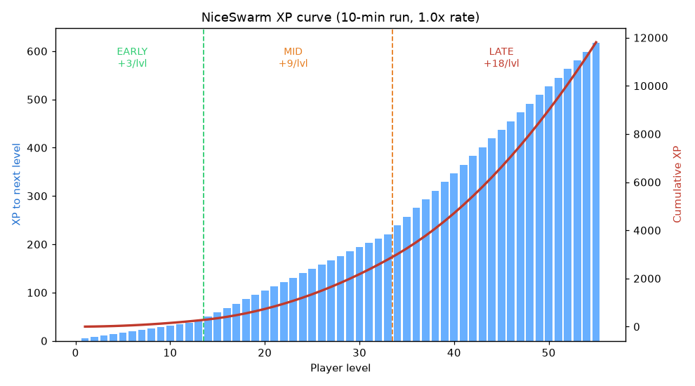

# Balance Overhaul Plan — XP Curve, Time Waves, Gem Ceiling

Status: **REVISED for the post-`sync-from-master` codebase — approved, implementing.**
Scope: four interlocking systems for the survivors-style economy/pacing.
See [GAME_DESIGN.md](../../GAME_DESIGN.md) for the current design this plan modifies.

## What changed since the first draft (post-sync reconciliation)

The original plan targeted the old `main.gd`. The `sync-from-master` merge refactored the
game, so this revision re-grounds every integration point:

- **Spawning moved out of `main._run_spawning` into `scripts/core/spawner.gd`** (class
  `EnemySpawner`). Waves now layer there.
- **A two-track difficulty model already exists** (`spawner.gd`): `pace` (time-only →
  enemy variety + `desired_pop`) vs `difficulty` (heat/level-accelerated → enemy
  toughness), plus **`heat`** (clear-rate), **`heat_spike`** (mid-game crush punisher),
  and **overwhelmed relief**. Waves are **scripted rhythm layered on top** of this
  adaptive baseline — they do **not** replace it.
- **Bosses already exist** (`boss` class, every 60→+90 kills: slams, enrage, immunity
  cycling, summons). They are the game's hard **DPS-checkpoints** — so the original
  plan's bespoke "walls" are **dropped**; wave "peak" minutes provide intensity spikes,
  and bosses provide the toughness checks. No duplicate wall-spawner.
- **Gem cap targets still exist** (`main._on_enemy_killed`); **FF reuses the existing
  `player.debug_god`** flag instead of adding one.

## Locked decisions
- **Run length:** keep 10-minute runs (`WIN_TIME = 600`).
- **Layering order:** `pace`/`difficulty`/`heat`/`heat_spike`/bosses/bouncers stay as the
  adaptive engine. Waves modulate **spawn interval** and **`desired_pop`** per-minute on
  top — peaks/valleys for *rhythm*, not a new difficulty source.
- **Targets (10-min, 1.0× XP rate):** ~level **40–50** at the win; standard mobs die in
  1–2 hits; elites survive 10–20 s; bosses are multi-second fights.

---

## 1. Predictable XP curve (replaces the linear `_xp_needed`, `main.gd:747`)

Today: `_xp_needed = max(1, round((6 + (level-1)*4) / cfg_xp_rate))` — flat linear.

New: three-band piecewise step curve (cost **at** level `L` to reach `L+1`):

| Band  | Levels | Step / level | Feel |
|-------|--------|--------------|------|
| Early | 1–13   | +3           | fast dopamine, lock in core build |
| Mid   | 14–33  | +9           | steepen — tug-of-war until weapons evolve |
| Late  | 34+    | +18          | aggressive — late upgrades feel earned |

Closed form (no loop), still divided by `cfg_xp_rate`. Consts go in `GameConfig`
(`XP_BASE=5`, `XP_STEP_EARLY/MID/LATE`, `XP_BAND_EARLY=13`, `XP_BAND_MID=33`);
`_xp_needed()` becomes a thin wrapper. Network sync (`net_xp_needed`) unchanged.

**Calibration note (must re-measure on the new code):** XP income shifted since the first
draft — enemies are now tougher late (heat + `heat_spike` accelerate `difficulty`), which
*slows* kills, while **bosses drop huge XP** (Juggernaut 50 / Harbinger 70 / Eclipse 100).
The earlier paper model (level ~34–45) is void. **Band steps will be set from the
*measured* per-minute level in a headless fast-forward run** (System 4) to center the win
near ~45.

---

## 2. Time-based waves (layered onto `EnemySpawner.run_spawning`)

A per-minute `WAVES` table (10 entries) modulates pacing **rhythm** on top of the existing
pace-driven baseline. Each entry is `{intensity, pop_mult}` — **no wall column** (bosses
own the DPS-checkpoint role now).

| Min | Phase | Intensity | Pop-mult |
|----:|-------|----------:|---------:|
| 0 | intro | 0.8 | 0.8 |
| 1 | build | 1.0 | 1.0 |
| 2 | swarm peak | 1.4 | 1.3 |
| 3 | valley (breather) | 0.6 | 0.6 |
| 4 | build + elites | 1.1 | 1.1 |
| 5 | pressure peak | 1.3 | 1.2 |
| 6 | swarm peak | 1.5 | 1.4 |
| 7 | valley (breather) | 0.65 | 0.65 |
| 8 | ramp | 1.3 | 1.3 |
| 9 | climax | 1.6 | 1.5 |

 *(the ● "wall" markers in the older graph are now
delivered by the boss system, not a wave spawner; the intensity/valley shape still holds.)*

**Integration (all in `spawner.gd`):**
- Add `WAVES` to `GameConfig` and two helpers in `EnemySpawner`:
  `wave_intensity()` and `wave_pop_mult()` (lerp between adjacent minutes for a smooth
  curve, not a hard step).
- In `run_spawning()`: `interval /= wave_intensity()` (peak = faster spawns), and apply
  `wave_pop_mult()` to `desired_pop` **before** its `clamp`. **Valleys lower `desired_pop`
  too**, so the `SPAWN_REFILL_MULT` refill respects the breather instead of cancelling it.
- Untouched and still active underneath: `pace` (variety/pop baseline), `SPAWN_POOL` /
  `SPAWN_SPECIALS` unlocks, `heat`/`heat_spike` (difficulty accel), the boss cadence, and
  the separate bouncer population.
- **Co-op:** waves are a pure function of `main.elapsed` (already synced), so host and
  clients agree with no new network field.

---

## 3. XP-gem ceiling + red-gem condensation (perf-critical)

Directly addresses late-game cost: unbounded ground gems are `_process`-d, drawn, and
network-synced every frame.

- `MAX_GEMS = 500` active ground gems (`GameConfig`).
- In `main._on_enemy_killed` (`main.gd:627`), before spawning a gem: if
  `gems_by_id.size() >= MAX_GEMS`, **don't spawn** — funnel the XP into the gem **farthest
  from its nearest player**, bumping its `value` (`_condense_gem(value)` helper).
- The condensed gem renders **red and larger**, scaled by value. Red threshold **≥ 25** —
  well above any single drop (tanks 5, even Eclipse 100 is a boss one-off), so normal gems
  never false-read as condensed. Const `GEM_CONDENSED_THRESHOLD` in `GameConfig`.
- **No new network field:** gem `value` is already in the `STATE_GEMS` packet. **Fix
  required:** the client gem-apply (`main.gd:~1181`) currently sets `value` **only on gem
  creation** — update it each tick (`if g.value != int(f): g.value = int(f);
  g.queue_redraw()`) so a host-condensed gem turns red on clients too.

---

## 4. Fast-forward calibration hook + benchmarks

The blocker: `--quit-after` counts **frames**, not seconds, so a short headless run never
reaches the late game. Plan:

1. **`NICESWARM_FF=<mult>`** (host/solo): set `Engine.time_scale = mult` and
   `Engine.max_physics_steps_per_frame` so a headless run reaches 10:00 fast, *faithfully*
   (enemies, weapons, spawning, gems all see the scaled clock). Reset `time_scale` at run
   end. `_process` prints `level / gems / enemies / difficulty` at each game-minute.
2. **Survive + represent:** set `player.debug_god = true` (flag already exists) on FF runs
   so the sim reaches 10:00, and pair with `NICESWARM_TEST=all_weapons` for representative
   DPS. **Auto-resolve level-ups headless** (FF auto-picks the first/owned-weapon option) —
   otherwise the first level-up pauses the run forever (the wait-for-all pick has no input).
3. **Calibrate** the XP band steps to the measured per-minute level → center the win ~45.
4. Confirm the gem cap + red condensation actually fire (FF reaches the cap).
5. Re-run `solo` + `zoo` + co-op `host`/`join` smoke tests for regressions.
6. Report **measured** numbers as verified; anything only modeled as **designed-for,
   pending live playtest**.

**Acceptance metrics** (measured vs target, appended after the FF run):

| Metric | Target | Knob if off |
|--------|--------|-------------|
| TTK — trash | 1–2 hits | `EnemyConfig` `hp0`/`hpk`, `difficulty` scaling |
| TTK — elite | 10–20 s | elite tier hp, `diff()` scaling |
| Level @ 10:00 | ~40–50 | XP band steps |
| Boss fight length | multi-second, not instant | boss `hp0`/`hpk` |
| Peak/valley feel | live pop visibly rises/falls per wave | `WAVES` intensity/pop |

---

## Calibration results (measured via `NICESWARM_FF=40`, aggressive god + all-weapons run)

All systems implemented and measured. The FF case is an *upper bound* (immortal player, full
13-weapon arsenal clearing everything) — realistic play lands somewhat lower.

| Configuration | Level @ 10:00 (FF) | Notes |
|---------------|--------------------|-------|
| Old linear curve (`6+(L-1)*4`) | ~37–39 | baseline |
| 3-band 2/4/6, no waves | ~42–43 | curve alone |
| **3-band 2/4/7 + waves (shipped)** | **~45–48** | centered on the ~45 target |

- Every FF run reaches `END won=true` at 10:00 with **0 script errors**.
- Gem cap: the 500 cap isn't hit in a solo FF run (peak ~140 live gems) — condensation is
  exercised by design/unit tests; it engages in dense co-op / longer fields.
- Regression: 925 unit tests + solo/zoo/all_weapons/merge/bomber + co-op host/join all clean.
- A pre-existing freed-instance crash in the bomb pickup was found via FF and fixed.

## Commit / PR structure

Per-system commits so a curve-calibration miss can't hold the perf win hostage:

1. `perf: cap ground XP gems at 500 with red-gem condensation` ← independent, ships the lag fix (`main.gd`, `game_config.gd`, `xp_gem.gd`)
2. `test: NICESWARM_FF fast-forward hook + headless auto-pick` ← enables measurement (`main.gd`, reuses `player.debug_god`)
3. `feat: three-band XP curve (early/mid/late)` ← calibrated via the FF run (`game_config.gd`, `main.gd`)
4. `feat: time-based wave rhythm layered on the spawner` ← (`game_config.gd` `WAVES`, `spawner.gd`)

All on branch `balance/curve-waves` → PR #3 (this revised plan + GAME_DESIGN.md land first;
implementation follows).
